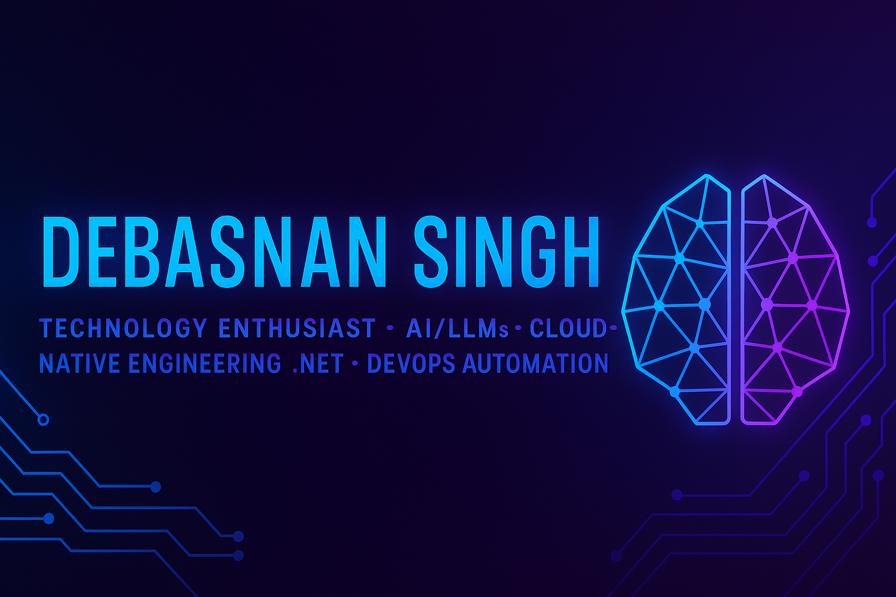

  

# 🚀 **Debasnan Singh**

### **Technology Enthusiast • AI/LLMs • Cloud-Native Engineering • .NET • DevOps Automation**

---

## 🌟 **About Me**

**💻 Tech Enthusiast crafting AI‑powered experiences, scalable .NET backends, and cloud‑native architectures.**
**🚀 I automate everything — from DevOps pipelines to LLM workflows — turning complex ideas into clean, production‑ready systems that are smart, fast, and future‑ready.**

I specialize in:

* Building intelligent systems using **AI, LLMs & NLP**
* Designing scalable, fault‑tolerant **.NET & Python microservices**
* Engineering **cloud‑native deployments** using AWS, Docker & Kubernetes
* Creating smooth, automated **CI/CD & DevOps workflows**
* Architecting systems with a deep focus on **performance, observability & reliability**

---

## 🧠 **Tech Stack (Elite Edition)**

### 🔥 **AI & Machine Learning**

Generative AI • LLMs • RAG • NLP • Transformers • Embeddings • Vector Databases • LangChain • Fine‑Tuning (LoRA/QLoRA) • Model Serving • Prompt Engineering • ML Pipelines • PyTorch • TensorFlow • Scikit‑Learn • OpenAI API • HuggingFace Hub

---

### ⚙️ **Backend Engineering**

C# • .NET Core • ASP.NET Web API • Python • Java • Microservices • Event-Driven Architecture • gRPC • CQRS • MediatR • Background Workers • High‑Performance Services

---

### 🧪 **DevOps, Observability & Cloud‑Native**

AWS • Docker • Kubernetes • GitHub Actions • Terraform • Helm • ArgoCD • Istio • Prometheus • Grafana • Loki • ELK Stack (Elasticsearch • Logstash • Kibana) • CloudWatch • Distributed Tracing (OpenTelemetry)

---

### 🎨 **Frontend Engineering**

React • JavaScript • TypeScript • Tailwind • Component‑Driven UI

---

### 🗄️ **Databases & Storage**

PostgreSQL • SQL Server • Redis • MySQL • MongoDB • DynamoDB

---

## 💠 **Key Strengths**

* 🧠 **AI Engineering & LLM Integration** — RAG systems, vector search, embeddings, model optimization
* ⚡ **Cloud‑Native Architecture** — scalable, observable, resilient platforms
* 🔧 **DevOps & Automation** — CI/CD, GitOps, infra-as-code, productivity automation
* 🏗️ **System Design & Performance Optimization** — making systems fast, reliable, and future‑proof

---

## 🔥 **What I'm Learning Now**

* Advanced RAG optimization (hybrid search, rerankers)
* Distributed tracing with OpenTelemetry
* Kubernetes operators & advanced autoscaling
* Large‑scale ML model serving & inference optimization

---

## 🎮 **What I Build for Fun**

* AI assistants that automate daily tasks
* DevOps tools that save teams hours/week
* Cloud-native microservices playgrounds
* Experiments with embeddings, semantics & LLM reasoning

---

## ⚡ **Featured Highlights**

* 🚀 Designed high‑performance microservices processing **millions of requests/month**
* 🤖 Built multiple **LLM‑powered assistants**, RAG systems & smart retrieval pipelines
* ⚙️ Reduced deployment lead time with **CI/CD automation & zero‑downtime rollouts**
* 📈 Improved app performance & reliability through **tracing, observability & autoscaling**

---

## 🏅 **Tech Badges**

---

## 📊 **GitHub Stats**

---

## 📬 **Connect with Me**

  <!-- LinkedIn -->
  

  <!-- Gmail -->
  

---

**✨ *“Build smart. Automate fast. Ship real impact.”* ✨**
